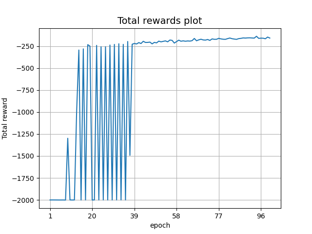

## Project description

This repository contains the source code for the COMP6247 Dynamic Maze Solving Project. Python file maze_solver.py
contains the developed code used for determining the shortest path to the end of the maze.

## Usage

Clone the repository and setup the conda environment to run the code:
```
cd <path_to_COMP6247_Dynamic_Maze_Solivng_Project>
conda env create -f maze_solver.yml
conda activate maze_solver
```

To run the code:
```
python maze_solver.py
```

If you want to skip the training part, comment out the following lines in maze_solver.py
```
print("Train maze solver...")
train_maze_solver(num_of_epochs=100)
```

## Reward convergence

The following plot demonstrates the convergence of the total reward received by the agent after approximately
50 epochs of training.



## Dynamic maze animation

The final animation displaying the shortest path to the end of the maze.


